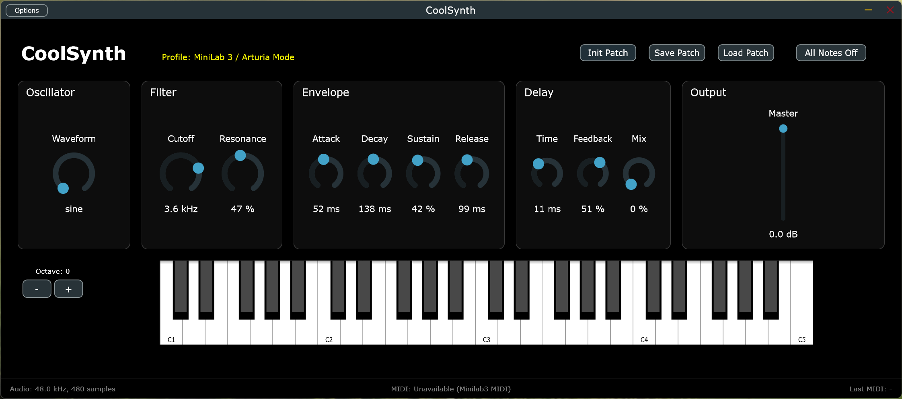
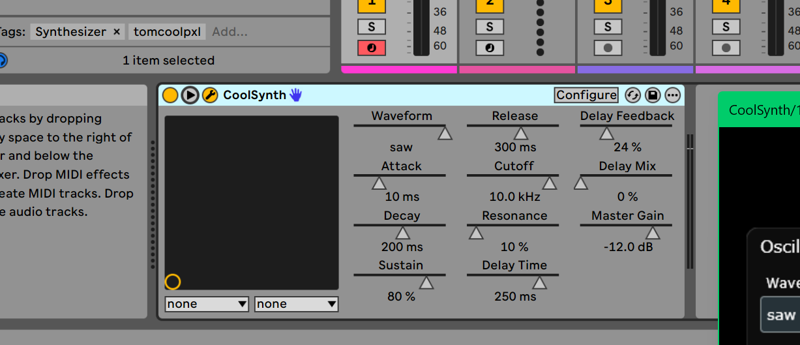

# CoolSynth



CoolSynth is a JUCE-based software synthesizer for Windows 11. It is built as both a standalone desktop instrument and a VST3 plugin, with the same synth engine and parameter set in both modes.

The current codebase is in the V2 transition: a Prophet-inspired, Stranger Things / S U R V I V E-adjacent subtractive polysynth with a one-page instrument panel, shared standalone/VST3 behavior, and an intentionally explicit patch/state compatibility break from older builds.

## Features

- Dual-oscillator plus noise subtractive voice architecture.
- Dedicated filter and amp ADSR envelopes with a resonant low-pass filter.
- Global LFO, constrained Poly Mod, pitch bend, glide, mono/unison play modes, vintage drift, and pan spread.
- Host-aware arpeggiator with standalone tempo fallback.
- Global drive, chorus, delay, reverb, and master output stages.
- Shared standalone and VST3 patch workflow with MIDI learn and panic support.

The same core sound engine drives both targets, so the standalone app and the VST3 plugin expose the same main synth controls.

## Standalone and VST3

The standalone application is the self-contained instrument. It handles audio device setup, MIDI input selection, and the extra runtime tools that make the synth easier to play and inspect outside a DAW.

In standalone mode, CoolSynth provides:

- audio backend, output device, sample rate, and buffer-size configuration
- one active MIDI input device at a time
- bundled factory controller profiles, including MiniLab 3 Arturia-mode auto-detect
- a MIDI monitor for incoming events
- remembered standalone settings for audio configuration, selected MIDI input, controller-profile selection, and learned MIDI CC mappings
- clear unavailable-state reporting if a remembered audio or MIDI device is missing when the app starts



The VST3 build uses the same synth engine and parameters inside a DAW. Audio routing, MIDI routing, and session management are handled by the host instead of the standalone UI. In plugin mode, the editor also exposes host-provided parameter context menus and parameter-under-mouse lookup when the host format supports them.

## MIDI Learn

In standalone mode, CoolSynth ships with a bundled MiniLab 3 / Arturia Mode factory profile and allows any exposed V2 panel control to override that profile with MIDI learn from a right-click context menu.

In plugin mode, the same learnable controls can capture DAW-routed live MIDI CC input from the plugin editor. Plugin learned bindings are stored in plugin state, so they restore with the host session. Plugin mode does not auto-load a hardware-specific factory profile.

- `Learn MIDI CC` arms the control and waits for an incoming CC message.
- `Cancel MIDI Learn` exits the armed state without changing the mapping.
- `Clear MIDI CC Mapping` removes the learned assignment for that control.
- Standalone `Options -> MIDI -> Reset MIDI Settings` clears remembered MIDI input, learned MIDI CC mappings, controller-profile selection, and CC-label preference while keeping audio settings intact.

Learned mappings are stored with standalone settings in standalone mode, and in plugin state in plugin mode. In both cases they override the active mapping for the mapped parameter.

## Patch Workflow

CoolSynth keeps the `.cspatch` extension, but the current V2 builds use an explicit V2-only patch/state boundary.

- `Init Patch` resets synth parameters to their defaults.
- `Save Patch` writes a `.cspatch` XML file containing only the current V2 synth parameter state.
- `Load Patch` restores that V2 parameter state without changing standalone audio settings, MIDI device selection, or learned MIDI mappings.
- Incompatible older patch/state payloads are rejected explicitly rather than partially loaded.

## Build

### Prerequisites

- Windows 11
- Git
- CMake 3.22 or newer
- Visual Studio 2022 Build Tools or Visual Studio 2022

### Configure and Build

```powershell
git submodule update --init --recursive
cmake -S . -B build -G "Visual Studio 17 2022" -A x64
cmake --build build --config Debug
```

To build a release configuration instead, change `Debug` to `Release` in the last command.

### Run Tests

```powershell
ctest --test-dir build -C Debug --output-on-failure
```

### Build Outputs

- `build/CoolSynth_artefacts/<Config>/Standalone/CoolSynth.exe`
- `build/CoolSynth_artefacts/<Config>/VST3/CoolSynth.vst3`

## CI/CD

GitHub automation is intentionally limited to manual validation and release tags.

- Manual validation workflow: `Windows Manual Validation`
- Workflow file: `.github/workflows/windows-manual-validation.yml`
- Trigger: `workflow_dispatch` only
- Branch pushes do not run CI automatically
- Release workflow file: `.github/workflows/windows-release.yml`
- Release trigger tags: `v*.*.*` and `v*.*.*-*`
- Public Windows release assets:
  - `CoolSynth-windows-x64-standalone-<tag>.zip`
  - `CoolSynth-windows-x64-vst3-<tag>.zip`
  - `CoolSynth-windows-x64-sha256-<tag>.txt`

Manual validation can be started from the GitHub Actions UI or with:

```powershell
gh workflow run windows-manual-validation.yml --ref <branch> -f configuration=Release -f run_tests=true -f package_assets=true
```

Publishing a Windows release is tag-driven:

```powershell
git tag v0.1.0-rc.1
git push origin v0.1.0-rc.1
```

Both workflows reuse the checked-in JUCE submodule path under `external/JUCE`; they do not download JUCE separately.
